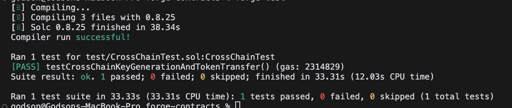
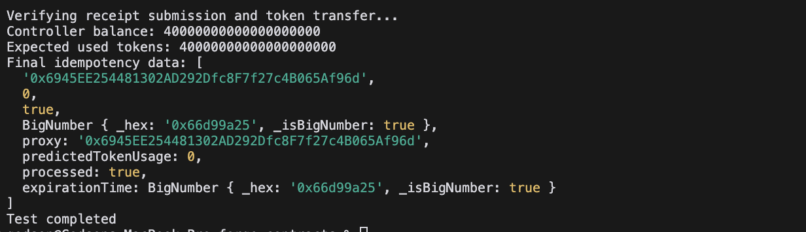
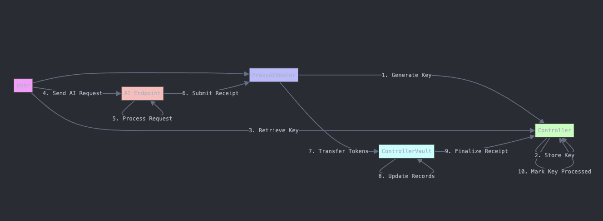

# ProxyAI (working title)

A decentralized middleware that allows users to securely share, access, and pay for AI services like GPT, using tokenized credits across multiple blockchain network.

## Summary

Included in this repository is:

- Solidity [Contracts]()
- Forge local [testing]()
- Testnet Testing [Scripts]()

- Frontend [Proxy_ai]()

### Testing locally

Clone down the repo, cd into it, then build and run unit tests:

```bash
git clone https://github.com/acgodson/proxy.git
cd forge-contracts
npm run build
forge test
```

**Expected output**



### Deploying to Testnet and Testing

You will need a wallet with at least 0.5 Testnet AVAX and 0.1 Testnet CELO.

- sourceChain:[ Obtain testnet AVAX here ]()
- targetChain: [Obtain testnet CELO here]()

create and update .env file

```bash
PRIVATE_KEY=your_wallet_private_key
```

```bash
npm run main
```

**Expected output**



---

## ProxyAI Service

# ProxyAI Flow Diagram

## ProxyAI Flow Diagram



| **Process**                                                      | **Description**                                                                                                                                               |
| ---------------------------------------------------------------- | ------------------------------------------------------------------------------------------------------------------------------------------------------------- |
| **Authorization Key Generation**                                 | - The user calls the `generateKey` function on the `ProxyAIRouter`, initiating a cross-chain request to the `Controller` on the target chain.                 |
|                                                                  | - The `Controller` on the target chain stores the idempotency key and relevant metadata, ensuring consistency across networks.                                |
| **Idempotency Key Retrieval and AI Requests**                    | - The user retrieves the `Idempotency Key` from the `Controller` using the original request hash.                                                             |
|                                                                  | - The retrieved key is added to the authorization header in the prompt sent to the offchain AI endpoint.                                                      |
| **Backend Verification, Token Transfer, and Receipt Submission** | - After backend verification and processing, a receipt (proof of usage) is submitted via the `submitReceipt` function on the `ProxyAIRouter`.                 |
|                                                                  | - Equivalent costs of operation in tokens are transferred to the `ControllerVault` on the target chain.                                                       |
|                                                                  | - The `ControllerVault` receives the tokens and receipt payload, updates its records, and interacts with the `Controller` to finalize the receipt processing. |
| **Receipt Processing**                                           | - The `ControllerVault` verifies the token transfer and receipt submission, ensuring that the idempotency key is marked as processed.                         |
|                                                                  | - The `Controller` updates the idempotency data as processed, finalizing the cycle.                                                                           |

## Smart Contracts
